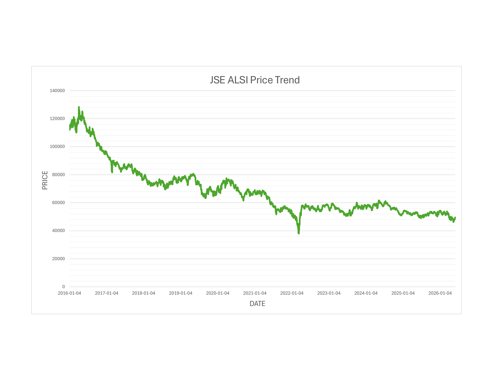
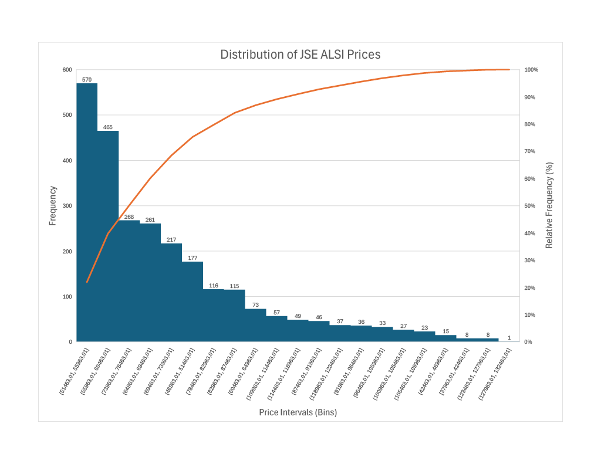

# JSE ALSI Financial Analysis Using Microsoft Excel

## Project Overview

This project presents a financial time-series analysis of the Johannesburg Stock Exchange All Share Index (JSE ALSI) using Microsoft Excel.

The analysis investigates:

- Historical price behaviour
- Daily returns
- Log returns
- Moving averages
- Rolling volatility
- Distributional characteristics

---

## Dataset

- Asset: JSE All Share Index (ALSI)
- Frequency: Daily
- Period: 2016–2026

---

## Skills Demonstrated

- Microsoft Excel
- Data Cleaning
- Financial Analytics
- Descriptive Statistics
- Time-Series Analysis
- Volatility Analysis
- Data Visualization

---

## Variables Created

| Variable | Description |
|----------|-------------|
| Daily Return | Percentage daily change |
| Log Return | Logarithmic return |
| 7-Day MA | Short-term trend |
| 30-Day MA | Medium-term trend |
| 90-Day MA | Long-term trend |
| 7-Day Volatility | Short-term volatility |
| 30-Day Volatility | Long-term volatility |

---

## Descriptive Statistics

| Statistic | Price | Daily Return | Log Return |
|------------|------------:|------------:|------------:|
| Mean | 68490.6820 | -0.0257 | -0.0003 |
| Median | 64551.3600 | -0.0584 | -0.0006 |
| Standard Deviation | 17744.3384 | 1.1328 | 0.0113 |
| Minimum | 37963.0100 | -8.6511 | -0.0905 |
| Maximum | 128455.6800 | 10.7681 | 0.1023 |
| Skewness | 1.2683 | 0.6225 | 0.4455 |
| Excess Kurtosis | 1.1376 | 9.0973 | 8.4997 |

---

## Visualizations

### JSE ALSI Price Trend

The JSE ALSI exhibited a clear long-term upward trend throughout the study period. Despite short-term fluctuations and temporary declines, the overall movement of the index remained positive.



### Distribution of JSE ALSI Prices



### Distribution of Log Returns


### Moving Average Analysis


### Rolling Volatility Analysis


---


## Key Findings

- The ALSI exhibited a strong long-term upward trend.
- Returns fluctuated around zero throughout the sample period.
- Return distributions displayed positive skewness.
- High excess kurtosis indicates the presence of extreme market movements.
- Moving averages confirmed the underlying market trend.
- Rolling volatility demonstrated periods of elevated market uncertainty.

---


## Excel Formulas Used

### Daily Return

```excel
=(B3/B2-1)*100
```

### Log Return

```excel
=LN(B3/B2)
```

### 7-Day Moving Average

```excel
=AVERAGE(B2:B8)
```

### 30-Day Moving Average

```excel
=AVERAGE(B2:B31)
```

### 90-Day Moving Average

```excel
=AVERAGE(B2:B91)
```

### Rolling Volatility

```excel
=STDEV(Log_Return_Range)
```

### Skewness

```excel
=SKEW(range)
```

### Excess Kurtosis

```excel
=KURT(range)
```


## Author

Maingo Israel

MSc Statistics Graduate | Financial Analytics | Data Analytics
