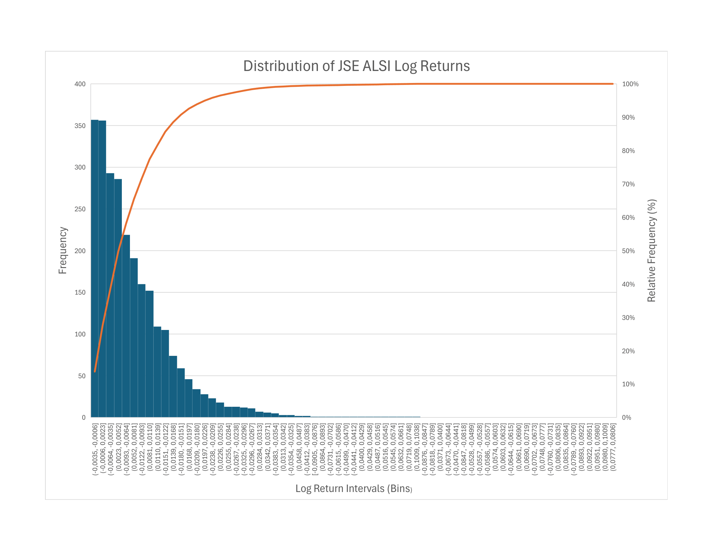
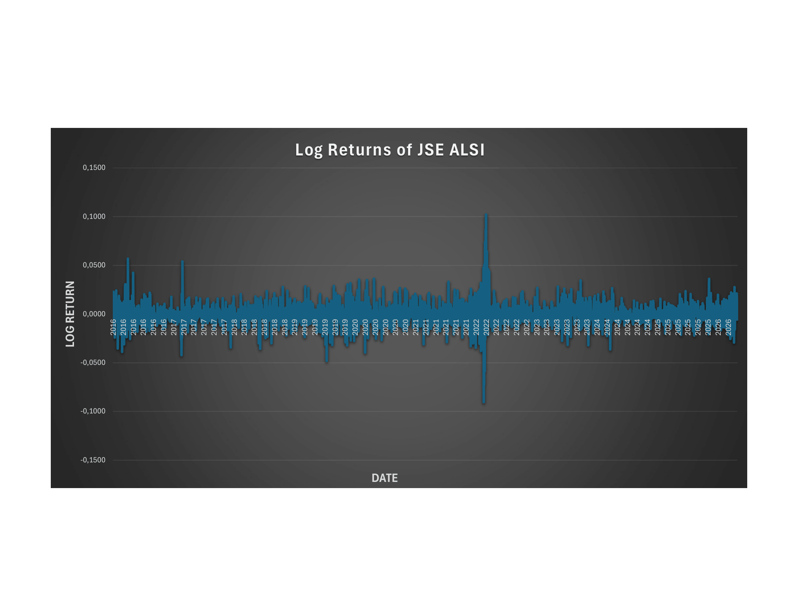
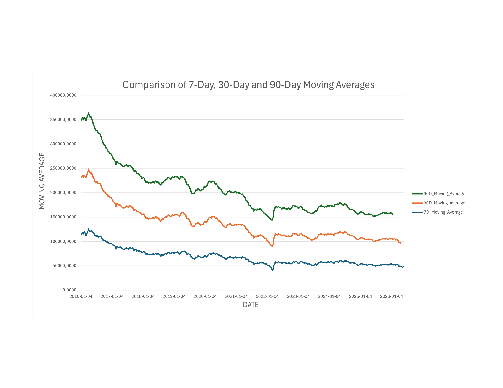
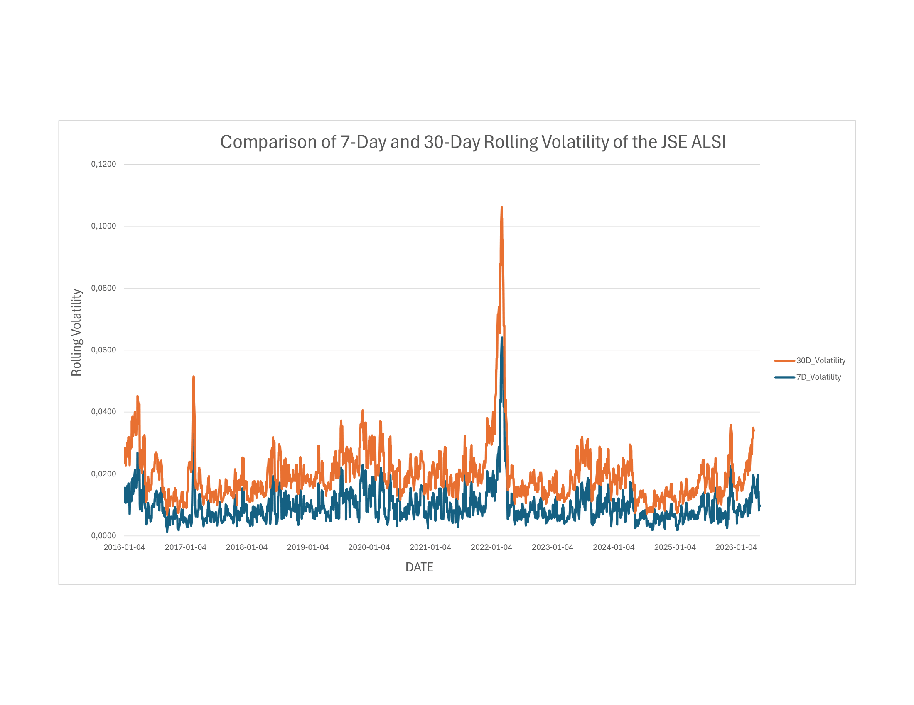

# JSE ALSI Financial Analysis Using Microsoft Excel

## Project Overview

This project presents a financial time-series analysis of the Johannesburg Stock Exchange All Share Index (JSE ALSI) using Microsoft Excel.

The analysis investigates:

- Historical price behaviour
- Daily returns
- Log returns
- Moving averages
- Rolling volatility
- Distributional characteristics

---

## Dataset

- Asset: JSE All Share Index (ALSI)
- Frequency: Daily
- Period: 2016-01-01 to 2026-06-03 (2603 Total Observations)

---

## Skills Demonstrated

- Microsoft Excel
- Data Cleaning
- Financial Analytics
- Descriptive Statistics
- Time-Series Analysis
- Volatility Analysis
- Data Visualization

---

## Variables Created

| Variable | Description |
|----------|-------------|
| Daily Return | Percentage daily change |
| Log Return | Logarithmic return |
| 7-Day MA | Short-term trend |
| 30-Day MA | Medium-term trend |
| 90-Day MA | Long-term trend |
| 7-Day Volatility | Short-term volatility |
| 30-Day Volatility | Long-term volatility |

---

## Descriptive Statistics

The JSE ALSI price series displayed positive skewness and moderate kurtosis, indicating a non-symmetric distribution with occasional extreme values. Daily and log returns exhibited high excess kurtosis, suggesting heavy tails and the presence of extreme market movements that deviate from normality.

| Statistic | Price | Daily Return | Log Return |
|------------|------------:|------------:|------------:|
| Mean | 68490.6820 | -0.0257 | -0.0003 |
| Median | 64551.3600 | -0.0584 | -0.0006 |
| Standard Deviation | 17744.3384 | 1.1328 | 0.0113 |
| Minimum | 37963.0100 | -8.6511 | -0.0905 |
| Maximum | 128455.6800 | 10.7681 | 0.1023 |
| Skewness | 1.2683 | 0.6225 | 0.4455 |
| Excess Kurtosis | 1.1376 | 9.0973 | 8.4997 |

---

## Visualizations

### JSE ALSI Price Trend

The JSE ALSI exhibited a clear long-term upward trend throughout the study period. Despite short-term fluctuations and temporary declines, the overall movement of the index remained positive.


### Distribution of JSE ALSI Prices

The distribution of JSE ALSI prices is positively skewed, with most observations concentrated at lower and middle price levels. The long right tail indicates that exceptionally high index values occurred less frequently during the study period.


### Distribution of JSE ALSI Log Returns

The distribution of log returns is centered around zero, indicating that small daily changes occurred more frequently than large changes. The presence of heavy tails suggests occasional extreme positive and negative market movements.



### Log Returns of JSE ALSI


The Log Returns fluctuate around zero, indicating that small daily changes were more common than large movements. Noticeable spikes reflect periods of heightened market volatility and uncertainty, while the clustering of fluctuations suggests time-varying volatility. 




### Moving Average (MA) Analysis

The 7-day, 30-day, and 90-day Moving Averages reveal the underlying trend of the JSE ALSI. While the 7-day moving average responds more quickly to short-term fluctuations, the 30-day and 90-day averages provide smoother representations of the long-term market direction.




### Rolling Volatility Analysis

The rolling volatility plot highlights periods of increased and decreased market uncertainty. The 7-day volatility responds rapidly to market shocks, whereas the 30-day volatility captures broader and more persistent changes in market risk.



---


## Key Findings

- The ALSI exhibited a strong long-term upward trend.
- Returns fluctuated around zero throughout the sample period.
- Return distributions displayed positive skewness.
- High excess kurtosis indicates the presence of extreme market movements.
- Moving averages confirmed the underlying market trend.
- Rolling volatility demonstrated periods of elevated market uncertainty.

---


## Methodology and Excel Implementation

### Daily Return

```excel
=((C3-C2)/C2)*100
```

### Log Return

```excel
=LN(C3/C2)
```

### 7-Day Moving Average

```excel
=AVERAGE(C2:C8)
```

### 30-Day Moving Average

```excel
=AVERAGE(C2:C31)
```

### 90-Day Moving Average

```excel
=AVERAGE(C2:C91)
```

### Rolling Volatility

```excel
=STDEV(Log_Return_Range)
```

### Skewness

```excel
=SKEW(range)
```

### Excess Kurtosis

```excel
=KURT(range)
```


## Author

Maingo Israel

MSc Statistics Graduate | Financial Analytics | Data Analytics
